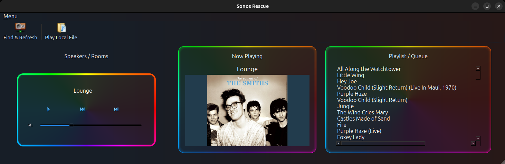

# Sonos Rescue

**Replacement Sonos Desktop Application**

_This project is not affiliated with or endorsed by Sonos._




## Overview

Sonos Rescue is an independent desktop application for discovering and controlling Sonos speakers on your local network. Built with Python, PyQt6, and SoCo, it provides playback and volume controls, displays the current queue and track information, and can stream music files from your computer to your speakers through a local HTTP server.

---

## Features

- Discover Sonos speakers and rooms on the local network.
- Select a room and control playback
- Play, pause, and skip tracks.
- Adjust speaker volume and mute state.
- Browse and play music from a local folder.
- Stream local music files to Sonos devices through a directory-bound HTTP server.
- Display the current playback queue; saved playlist management is planned
- Display track metadata and playback state.
- Retrieve and display album artwork.
- Cache album artwork locally using SQLite to reduce repeated network requests.
- Poll playback information in a background worker to keep the UI responsive.

---

## Requirements

- Python 3.12 or newer
- A desktop environment supported by PyQt6
- Sonos speakers accessible on the same local network
- A local music folder for local-file playback
- Runtime dependencies are declared in `pyproject.toml`.
- Development and testing tools are listed in `requirements-dev.txt`.

The application is currently intended for desktop environments with a display.
Linux is tested in this development environment. Windows and macOS support may be possible but not claimed (or tested yet).

### Network requirements

The computer running Sonos Rescue and the Sonos speakers must be connected to the same local network. The speakers must also be able to connect back to the computer over the local network to stream local music files.

If speakers are not discovered, check the network connection and ensure that your firewall allows local network discovery and connections to the application's HTTP streaming server.

---

## Installation

### Set up a virtual environment

Clone the repository and create a virtual environment:

```bash
git clone https://github.com/SpikeyMikie/Sonos_Rescue.git
cd Sonos_Rescue

python -m venv .venv
source .venv/bin/activate
```

On Windows, activate the virtual environment with:

```bash
.venv\Scripts\Activate.ps1
```

on Linux / Mac use:

```bash
source .venv/bin/activate
```

Upgrade pip, then choose one of the installation options below.

### Runtime installation

Install Sonos Rescue and its runtime dependencies:

```bash
python -m pip install --upgrade pip
python -m pip install .
```

### Development and testing installation

Install the development and testing dependencies, then install the project in editable mode. The development requirements include the runtime dependencies.

```bash
python -m pip install --upgrade pip
python -m pip install -r requirements-dev.txt
python -m pip install --editable .
```

The editable install makes the `sonos-rescue` command available and uses your working tree's source code, so local code changes take effect without reinstalling the package. Runtime dependencies are declared in `pyproject.toml`; development dependencies are listed in `requirements-dev.txt`.

---

## Running the application

From the repository root, activate the virtual environment and run:

Linux / Mac:

```bash
source .venv/bin/activate
sonos-rescue
```

On Windows PowerShell:

```bash
.venv\Scripts\Activate.ps1
sonos-rescue
```

If for some reason the command is not available, run it through Python instead:

```bash
python -m sonos_rescue.sonos_rescue
```

---

## Basic Usage

1. Start Sonos Rescue from the repository root:
    ```bash
    sonos-rescue
    ```
2. Wait for the application to discover Sonos speakers on the local network.
3. Select a room or speaker from the rooms panel.
4. Use the playback controls to play, pause, and skip tracks.
5. Adjust the volume or mute the selected speaker as required.
6. To play local music, choose a folder containing supported audio files. Sonos Rescue starts a local HTTP server so the selected speaker can access those files.
7. Select a track to view its metadata, playback state, queue information, and available album artwork.
8. When finished, close the application normally. The local music server shuts down with the application.

---

## Troubleshooting

### No Sonos speakers are discovered

- Confirm that the computer and Sonos speakers are connected to the same local network.
- Check that the speakers are powered on and reachable from the computer.
- Check that your firewall allows local network discovery.
- Restart Sonos Rescue and allow time for discovery to complete.

### Local music will not play

- Ensure a room has been selected prior to selecting the audio file
- Try selecting the audio file again after restarting the application.
- Ensure the Sonos speaker can connect back to the computer over the local network.
- Check that your firewall allows connections to the local HTTP streaming server.
- Avoid using a guest or isolated Wi-Fi network.

### Album artwork is missing

- The track may not contain embedded artwork.
- Remote artwork may be unavailable or temporarily unreachable.
- Check that the audio file contains valid metadata.
- Restarting the application may allow artwork to be fetched again.

### The application will not start

- Confirm that Python 3.12 or newer is installed.
- Activate the project virtual environment.
- Confirm that the application was installed with:

    ```bash
    python -m pip install --editable .
    ```

- If the `sonos-rescue` command is unavailable, try:
    ```bash
    python -m sonos_rescue.sonos_rescue
    ```

### Dependency or PyQt6 errors

- Confirm that the virtual environment is active.

- Upgrade pip:

    ```bash
    python -m pip install --upgrade pip
    ```

- Reinstall the project dependencies:

    ```bash
    python -m pip install --editable .
    ```

- For development dependencies, run:
    ```bash
    python -m pip install -r requirements-dev.txt
    ```

### Port already in use

Sonos Rescue uses a local HTTP server to stream music files to Sonos speakers. It normally handles a busy port automatically, if startup still reports that no port is available, check for other processes.

### Still having problems?

Please include the operating system, Python version, installation command, relevant error message, and steps to reproduce when opening an issue.

---

## Architecture

Project map and architecture documentation and diagrams are automated, the outputs are linked below.

Markdown Documents:

- [Architecture Guide](docs/architecture.md)
- [Dependency Report](docs/dependencies.md)
- [Generated Project Map](docs/project-map.md)

Mermaid Diagrams:

- [app-overview](docs/diagrams/app-overview.mmd)
- [architecture](docs/diagrams/architecture.mmd)
- [class-relationships](docs/diagrams/class-relationships.mmd)
- [dependencies](docs/diagrams/dependencies.mmd)
- [ui-architecture](docs/diagrams/ui-architecture.mmd)

---

## Engineering Highlights

- Modular PyQt6 application structure
- Worker-thread playback polling with Qt signal communication
- SQLite-backed artwork caching
- Directory-bound local HTTP music server
- Static analysis with Pyright and mypy
- Typed, immutable playback update models
- Graceful handling of Sonos network and disconnection errors
- Automated tests for:
    - database
    - networking
    - playback
    - artwork
    - server
    - UI components
- Automated AST-based Architecture Documentation Generator from the Python source tree, including:
    - Project map
    - Dependency report
    - Architecture guide
    - Mermaid diagrams:
        - app overview
        - architecture
        - dependencies
        - class diagrams

---

## Project Status

Sonos Rescue is in active development. Its core desktop workflows are implemented and usable for local testing.

| Area               | Status                                                 |
| ------------------ | ------------------------------------------------------ |
| Development        | Active                                                 |
| Core functionality | Implemented; usability and features continue to evolve |
| Platform testing   | Linux tested; Windows and macOS not verified           |
| Release maturity   | Pre-release                                            |

---

## Roadmap

**Planned**

- Playlist support and management
- Enhanced queue management
- Application settings
- Further UI refinement
- Broader platform support

**Future Research**

- Embedded or Raspberry Pi experiments

---

## Contributing

Contributions, bug reports, and feature suggestions are welcome.

1. Open an issue on GitHub to discuss changes or report a bug - [GitHub Issue Tracker](https://github.com/SpikeyMikie/Sonos_Rescue/issues)
2. Fork the repository and create a branch for your change.
3. Make the change and add or update tests where appropriate.
4. Run the test suite with `pytest`.
5. Open a pull request describing the change and any relevant test results.

Tests will require installing development dependencies, requirements-dev.txt provides them.

---

## Credits / Acknowledgements

This project began as an exploration of the excellent SoCo-Tk project by Labero, which demonstrated how the SoCo library could be used to build a desktop Sonos controller.

My version has gradually diverged through refactoring, new features and architectural changes as I have learned Python and software engineering.

SoCo-Tk Repo: https://github.com/labero/SoCo-Tk

---

## Technologies

Sonos Rescue is written with Python 3.12+ and also uses the following technologies:

- [SoCo](https://github.com/rahims/SoCo) - Communicate with Sonos devices.
- [PyQt6](https://pypi.org/project/PyQt6) - GUI
- [SQLite](https://www.sqlite.org) - Artwork cache and database
- [PyTest](https://docs.pytest.org) - Automated testing

---

## License

Sonos Rescue is licensed under the GNU General Public License v3.0 or later.
See [COPYING.txt](COPYING.txt) for the full license text.

---
