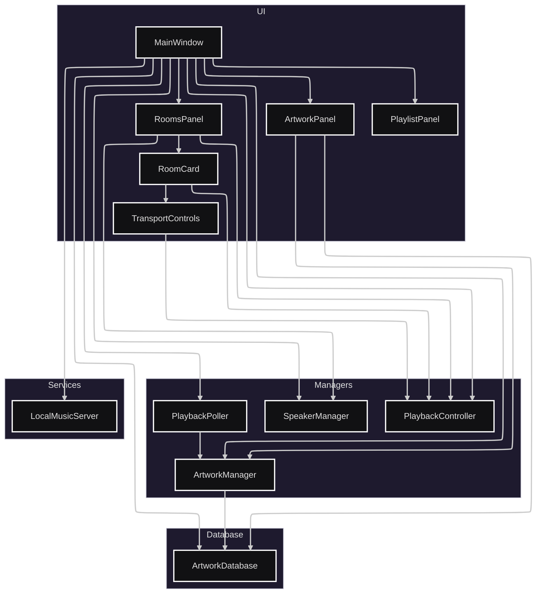
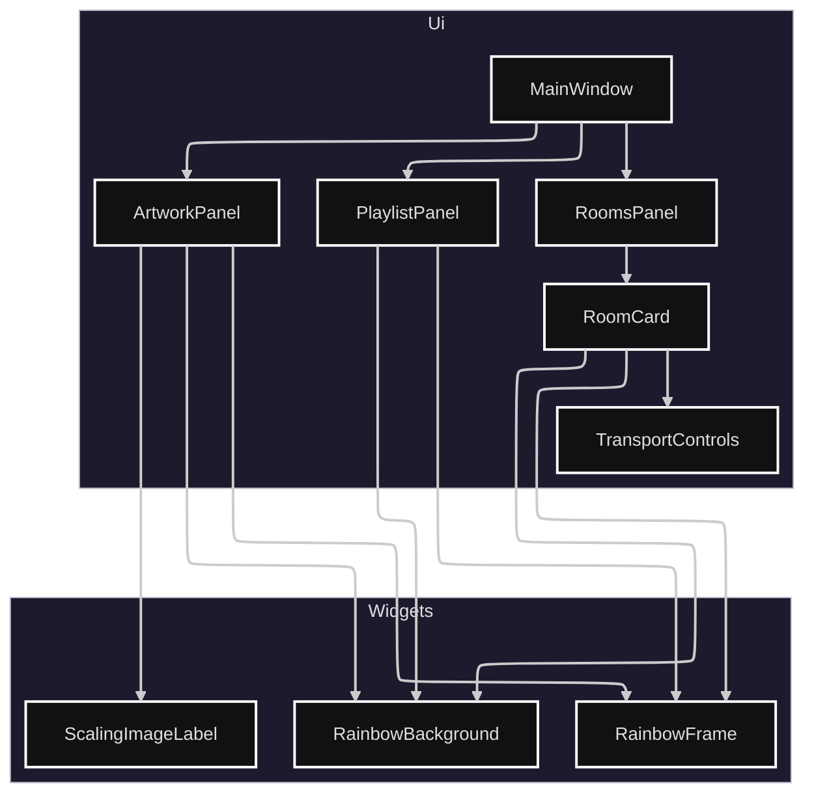

# Architecture

> Generated from the Python source tree by `tools/generate_project_docs.py`.

## Overview

Sonos Rescue is a PyQt6 desktop controller. Its UI coordinates speaker discovery and playback managers, uses a local HTTP service to expose selected music files to Sonos devices, and caches artwork in SQLite.

## Application Layers

### UI Layer

- `sonos_rescue.ui.artwork_panel` (`ArtworkPanel`)
- `sonos_rescue.ui.main_window` (`MainWindow`)
- `sonos_rescue.ui.playlist_panel` (`PlaylistPanel`)
- `sonos_rescue.ui.room_card` (`RoomCard`)
- `sonos_rescue.ui.rooms_panel` (`RoomsPanel`)
- `sonos_rescue.ui.transport_controls` (`TransportControls`)
- `sonos_rescue.ui.widgets.rainbow_background` (`RainbowBackground`) — A widget that fills its whole area with a translucent rainbow gradient. parameters: - radius: the corner radius of the backgrou...
- `sonos_rescue.ui.widgets.rainbow_frame` (`RainbowFrame`) — A QFrame with a soft glowing rainbow border.
- `sonos_rescue.ui.widgets.scaling_image_label` (`ScalingImageLabel`) — A QLabel that rescales its pixmap (keeping aspect ratio) to fill its current size.

### Manager Layer

- `sonos_rescue.managers.artwork_manager` (`ArtworkManager`) — Manages album artwork retrieval, caching, and display for Sonos devices.
- `sonos_rescue.managers.playback_controller` (`PlaybackController`) — Handles playback control for the selected Sonos speaker. This class provides methods to play, pause, skip tracks, and adjust vo...
- `sonos_rescue.managers.playback_poller` (`PlaybackPoller`) — Playback poller for SoCo speakers.
- `sonos_rescue.managers.speaker_manager` (`SpeakerManager`) — Manages the discovery and selection of Sonos speakers. This class encapsulates the logic for discovering available Sonos device...

### Service Layer

- `sonos_rescue.services.local_music_server` (`LocalMusicServer`) — A lightweight HTTP server for serving local music files to Sonos devices. Sonos speakers cannot play files directly from the lo...

### Database Layer

- `sonos_rescue.database.database` (`ArtworkDatabase`) — Database module for Sonos Rescue.

### Utility Layer

- `sonos_rescue.utils.network`
- `sonos_rescue.utils.resources`

## Threading Model

`MainWindow` moves `PlaybackPoller` to a `QThread`. The poller reads Sonos playback data and fetches artwork away from the GUI thread, then emits an immutable `NowPlayingUpdate` snapshot through a Qt signal. `MainWindow.apply_now_playing_update()` applies the snapshot and updates widgets on the GUI thread. Artwork retrieval returns plain bytes; creation and display of Qt pixmaps remain in the UI path.

```text
PlaybackPoller (worker thread)
    → Qt signal carrying NowPlayingUpdate
    → MainWindow.apply_now_playing_update()
    → Qt widgets (GUI thread)
```

## Artwork Data Flow

The worker calls `ArtworkManager.resolve_and_fetch_art()` to resolve the Sonos URL, check the SQLite cache, or fetch and process image bytes. It carries the immutable `ArtResult` to the GUI in `NowPlayingUpdate`. `MainWindow.apply_now_playing_update()` checks the in-memory `QPixmap` cache, creates a pixmap when needed, and updates the artwork widget on the GUI thread.

## Local Music Server

`LocalMusicServer` serves files from its configured directory using a background HTTP server. The handler is bound to that directory; the process working directory is not changed. `MainWindow` constructs a Sonos-accessible URL and asks the selected speaker to play it.

## Data Flow

- `SpeakerManager` discovers speakers and emits signals consumed by the UI.
- UI controls delegate playback operations to `PlaybackController`.
- `PlaybackPoller` periodically collects playback and queue state and publishes an immutable update for the UI.
- `ArtworkManager` coordinates artwork retrieval and its SQLite cache.

## Regenerating Documentation

From the repository root, run `python tools/generate_project_docs.py`. The AST scanner writes the project map, this architecture guide, the canonical import report, and the five Mermaid source files. Repeated runs without source changes produce stable output; no SVG files or source-code changes are generated.

## Architecture Diagrams

### App Overview



Source: [`diagrams/app-overview.mmd`](diagrams/app-overview.mmd).

### Architecture

```mermaid
---
config:
  theme: redux-dark-color
---
flowchart TD

    subgraph ui["UI"]
        module_sonos__rescue_ui_artwork__panel["ArtworkPanel"]
        module_sonos__rescue_ui_main__window["MainWindow"]
        module_sonos__rescue_ui_playlist__panel["PlaylistPanel"]
        module_sonos__rescue_ui_room__card["RoomCard"]
        module_sonos__rescue_ui_rooms__panel["RoomsPanel"]
        module_sonos__rescue_ui_transport__controls["TransportControls"]
    end

    subgraph managers["Managers"]
        module_sonos__rescue_managers_artwork__manager["ArtworkManager"]
        module_sonos__rescue_managers_playback__controller["PlaybackController"]
        module_sonos__rescue_managers_playback__poller["PlaybackPoller"]
        module_sonos__rescue_managers_speaker__manager["SpeakerManager"]
    end

    subgraph services["Services"]
        module_sonos__rescue_services_local__music__server["LocalMusicServer"]
    end

    subgraph database["Database"]
        module_sonos__rescue_database_database["ArtworkDatabase"]
    end

    subgraph external["External systems"]
        external_PyQt6["PyQt6"]
        external_http["Local HTTP server"]
        external_pathlib["Filesystem"]
        external_soco["SoCo / Sonos"]
        external_sqlite3["SQLite"]
        external_urllib["HTTP"]
    end

    module_sonos__rescue_database_database --> external_sqlite3
    module_sonos__rescue_managers_artwork__manager --> module_sonos__rescue_database_database
    module_sonos__rescue_managers_artwork__manager --> external_PyQt6
    module_sonos__rescue_managers_artwork__manager --> external_pathlib
    module_sonos__rescue_managers_artwork__manager --> external_soco
    module_sonos__rescue_managers_artwork__manager --> external_urllib
    module_sonos__rescue_managers_playback__controller --> external_soco
    module_sonos__rescue_managers_playback__poller --> module_sonos__rescue_managers_artwork__manager
    module_sonos__rescue_managers_playback__poller --> external_PyQt6
    module_sonos__rescue_managers_playback__poller --> external_soco
    module_sonos__rescue_managers_speaker__manager --> external_PyQt6
    module_sonos__rescue_managers_speaker__manager --> external_soco
    module_sonos__rescue_services_local__music__server --> external_http
    module_sonos__rescue_services_local__music__server --> external_pathlib
    module_sonos__rescue_ui_artwork__panel --> module_sonos__rescue_database_database
    module_sonos__rescue_ui_artwork__panel --> module_sonos__rescue_managers_artwork__manager
    module_sonos__rescue_ui_artwork__panel --> external_PyQt6
    module_sonos__rescue_ui_main__window --> module_sonos__rescue_database_database
    module_sonos__rescue_ui_main__window --> module_sonos__rescue_managers_artwork__manager
    module_sonos__rescue_ui_main__window --> module_sonos__rescue_managers_playback__controller
    module_sonos__rescue_ui_main__window --> module_sonos__rescue_managers_playback__poller
    module_sonos__rescue_ui_main__window --> module_sonos__rescue_managers_speaker__manager
    module_sonos__rescue_ui_main__window --> module_sonos__rescue_services_local__music__server
    module_sonos__rescue_ui_main__window --> module_sonos__rescue_ui_artwork__panel
    module_sonos__rescue_ui_main__window --> module_sonos__rescue_ui_playlist__panel
    module_sonos__rescue_ui_main__window --> module_sonos__rescue_ui_rooms__panel
    module_sonos__rescue_ui_main__window --> external_PyQt6
    module_sonos__rescue_ui_main__window --> external_pathlib
    module_sonos__rescue_ui_main__window --> external_soco
    module_sonos__rescue_ui_main__window --> external_urllib
    module_sonos__rescue_ui_playlist__panel --> external_PyQt6
    module_sonos__rescue_ui_room__card --> module_sonos__rescue_managers_playback__controller
    module_sonos__rescue_ui_room__card --> module_sonos__rescue_ui_transport__controls
    module_sonos__rescue_ui_room__card --> external_PyQt6
    module_sonos__rescue_ui_room__card --> external_soco
    module_sonos__rescue_ui_rooms__panel --> module_sonos__rescue_managers_playback__controller
    module_sonos__rescue_ui_rooms__panel --> module_sonos__rescue_managers_speaker__manager
    module_sonos__rescue_ui_rooms__panel --> module_sonos__rescue_ui_room__card
    module_sonos__rescue_ui_rooms__panel --> external_PyQt6
    module_sonos__rescue_ui_rooms__panel --> external_soco
    module_sonos__rescue_ui_transport__controls --> module_sonos__rescue_managers_playback__controller
    module_sonos__rescue_ui_transport__controls --> external_PyQt6
    module_sonos__rescue_services_local__music__server -->|streams files to| external_soco
```



Source: [`diagrams/architecture.mmd`](diagrams/architecture.mmd).

### UI Architecture



Source: [`diagrams/ui-architecture.mmd`](diagrams/ui-architecture.mmd).

### Class Relationships

```mermaid
---
config:
  layout: elk
  theme: redux-dark-color
  class:
    hideEmptyMembersBox: true
---
classDiagram
    class class_module_sonos__rescue_database_database_ArtworkDatabase["ArtworkDatabase"]
    class class_module_sonos__rescue_managers_artwork__manager_ArtResult["ArtResult"]
    class class_module_sonos__rescue_managers_artwork__manager_ArtworkManager["ArtworkManager"]
    class class_module_sonos__rescue_managers_playback__controller_PlaybackController["PlaybackController"]
    class class_module_sonos__rescue_managers_playback__poller_NowPlayingUpdate["NowPlayingUpdate"]
    class class_module_sonos__rescue_managers_playback__poller_PlaybackPoller["PlaybackPoller"]
    class class_module_sonos__rescue_managers_speaker__manager_SpeakerManager["SpeakerManager"]
    class class_module_sonos__rescue_services_local__music__server_LocalMusicServer["LocalMusicServer"]
    class class_module_sonos__rescue_services_local__music__server_PortInUseError["PortInUseError"]
    class class_module_sonos__rescue_services_local__music__server_QuietHTTPRequestHandler["QuietHTTPRequestHandler"]
    class class_module_sonos__rescue_ui_artwork__panel_ArtworkPanel["ArtworkPanel"]
    class class_module_sonos__rescue_ui_main__window_MainWindow["MainWindow"]
    class class_module_sonos__rescue_ui_playlist__panel_PlaylistPanel["PlaylistPanel"]
    class class_module_sonos__rescue_ui_room__card_RoomCard["RoomCard"]
    class class_module_sonos__rescue_ui_rooms__panel_RoomsPanel["RoomsPanel"]
    class class_module_sonos__rescue_ui_transport__controls_TransportControls["TransportControls"]
    class class_module_sonos__rescue_ui_widgets_rainbow__background_RainbowBackground["RainbowBackground"]
    class class_module_sonos__rescue_ui_widgets_rainbow__frame_RainbowFrame["RainbowFrame"]
    class class_module_sonos__rescue_ui_widgets_scaling__image__label_ScalingImageLabel["ScalingImageLabel"]
    class external_module_Exception["Exception"]
    class external_module_QFrame["QFrame"]
    class external_module_QLabel["QLabel"]
    class external_module_QMainWindow["QMainWindow"]
    class external_module_QObject["QObject"]
    class external_module_QWidget["QWidget"]
    class external_module_SimpleHTTPRequestHandler["SimpleHTTPRequestHandler"]
    class_module_sonos__rescue_managers_artwork__manager_ArtworkManager --> class_module_sonos__rescue_database_database_ArtworkDatabase
    class_module_sonos__rescue_managers_artwork__manager_ArtworkManager ..> class_module_sonos__rescue_managers_artwork__manager_ArtResult
    class_module_sonos__rescue_managers_playback__poller_NowPlayingUpdate --> class_module_sonos__rescue_managers_artwork__manager_ArtResult
    class_module_sonos__rescue_managers_playback__poller_PlaybackPoller ..> class_module_sonos__rescue_managers_artwork__manager_ArtResult
    class_module_sonos__rescue_managers_playback__poller_PlaybackPoller --> class_module_sonos__rescue_managers_artwork__manager_ArtworkManager
    class_module_sonos__rescue_managers_playback__poller_PlaybackPoller ..> class_module_sonos__rescue_managers_playback__poller_NowPlayingUpdate
    class_module_sonos__rescue_services_local__music__server_LocalMusicServer ..> class_module_sonos__rescue_services_local__music__server_PortInUseError
    class_module_sonos__rescue_services_local__music__server_LocalMusicServer ..> class_module_sonos__rescue_services_local__music__server_QuietHTTPRequestHandler
    class_module_sonos__rescue_ui_artwork__panel_ArtworkPanel *-- class_module_sonos__rescue_managers_artwork__manager_ArtworkManager
    class_module_sonos__rescue_ui_artwork__panel_ArtworkPanel *-- class_module_sonos__rescue_ui_widgets_rainbow__background_RainbowBackground
    class_module_sonos__rescue_ui_artwork__panel_ArtworkPanel *-- class_module_sonos__rescue_ui_widgets_rainbow__frame_RainbowFrame
    class_module_sonos__rescue_ui_artwork__panel_ArtworkPanel *-- class_module_sonos__rescue_ui_widgets_scaling__image__label_ScalingImageLabel
    class_module_sonos__rescue_ui_main__window_MainWindow *-- class_module_sonos__rescue_managers_artwork__manager_ArtworkManager
    class_module_sonos__rescue_ui_main__window_MainWindow *-- class_module_sonos__rescue_managers_playback__controller_PlaybackController
    class_module_sonos__rescue_ui_main__window_MainWindow ..> class_module_sonos__rescue_managers_playback__poller_NowPlayingUpdate
    class_module_sonos__rescue_ui_main__window_MainWindow *-- class_module_sonos__rescue_managers_playback__poller_PlaybackPoller
    class_module_sonos__rescue_ui_main__window_MainWindow *-- class_module_sonos__rescue_managers_speaker__manager_SpeakerManager
    class_module_sonos__rescue_ui_main__window_MainWindow *-- class_module_sonos__rescue_services_local__music__server_LocalMusicServer
    class_module_sonos__rescue_ui_main__window_MainWindow *-- class_module_sonos__rescue_ui_artwork__panel_ArtworkPanel
    class_module_sonos__rescue_ui_main__window_MainWindow *-- class_module_sonos__rescue_ui_playlist__panel_PlaylistPanel
    class_module_sonos__rescue_ui_main__window_MainWindow *-- class_module_sonos__rescue_ui_rooms__panel_RoomsPanel
    class_module_sonos__rescue_ui_playlist__panel_PlaylistPanel *-- class_module_sonos__rescue_ui_widgets_rainbow__background_RainbowBackground
    class_module_sonos__rescue_ui_playlist__panel_PlaylistPanel *-- class_module_sonos__rescue_ui_widgets_rainbow__frame_RainbowFrame
    class_module_sonos__rescue_ui_room__card_RoomCard ..> class_module_sonos__rescue_managers_playback__controller_PlaybackController
    class_module_sonos__rescue_ui_room__card_RoomCard *-- class_module_sonos__rescue_ui_transport__controls_TransportControls
    class_module_sonos__rescue_ui_room__card_RoomCard *-- class_module_sonos__rescue_ui_widgets_rainbow__background_RainbowBackground
    class_module_sonos__rescue_ui_room__card_RoomCard *-- class_module_sonos__rescue_ui_widgets_rainbow__frame_RainbowFrame
    class_module_sonos__rescue_ui_rooms__panel_RoomsPanel --> class_module_sonos__rescue_managers_playback__controller_PlaybackController
    class_module_sonos__rescue_ui_rooms__panel_RoomsPanel --> class_module_sonos__rescue_managers_speaker__manager_SpeakerManager
    class_module_sonos__rescue_ui_rooms__panel_RoomsPanel --> class_module_sonos__rescue_ui_room__card_RoomCard
    class_module_sonos__rescue_ui_transport__controls_TransportControls --> class_module_sonos__rescue_managers_playback__controller_PlaybackController
    external_module_QObject <|-- class_module_sonos__rescue_managers_playback__poller_PlaybackPoller
    external_module_QObject <|-- class_module_sonos__rescue_managers_speaker__manager_SpeakerManager
    external_module_Exception <|-- class_module_sonos__rescue_services_local__music__server_PortInUseError
    external_module_SimpleHTTPRequestHandler <|-- class_module_sonos__rescue_services_local__music__server_QuietHTTPRequestHandler
    external_module_QWidget <|-- class_module_sonos__rescue_ui_artwork__panel_ArtworkPanel
    external_module_QMainWindow <|-- class_module_sonos__rescue_ui_main__window_MainWindow
    external_module_QWidget <|-- class_module_sonos__rescue_ui_playlist__panel_PlaylistPanel
    external_module_QWidget <|-- class_module_sonos__rescue_ui_room__card_RoomCard
    external_module_QWidget <|-- class_module_sonos__rescue_ui_rooms__panel_RoomsPanel
    external_module_QWidget <|-- class_module_sonos__rescue_ui_transport__controls_TransportControls
    external_module_QWidget <|-- class_module_sonos__rescue_ui_widgets_rainbow__background_RainbowBackground
    external_module_QFrame <|-- class_module_sonos__rescue_ui_widgets_rainbow__frame_RainbowFrame
    external_module_QLabel <|-- class_module_sonos__rescue_ui_widgets_scaling__image__label_ScalingImageLabel
```



Source: [`diagrams/class-relationships.mmd`](diagrams/class-relationships.mmd).

### Dependencies

```mermaid
---
config:
  theme: neo-dark
  layout: elk
---
flowchart LR
    module_sonos__rescue_database_database["sonos_rescue.database.database"]
    module_sonos__rescue_managers_artwork__manager["sonos_rescue.managers.artwork_manager"]
    module_sonos__rescue_managers_playback__controller["sonos_rescue.managers.playback_controller"]
    module_sonos__rescue_managers_playback__poller["sonos_rescue.managers.playback_poller"]
    module_sonos__rescue_managers_speaker__manager["sonos_rescue.managers.speaker_manager"]
    module_sonos__rescue_services_local__music__server["sonos_rescue.services.local_music_server"]
    module_sonos__rescue_sonos__rescue["sonos_rescue.sonos_rescue"]
    module_sonos__rescue_ui_artwork__panel["sonos_rescue.ui.artwork_panel"]
    module_sonos__rescue_ui_main__window["sonos_rescue.ui.main_window"]
    module_sonos__rescue_ui_playlist__panel["sonos_rescue.ui.playlist_panel"]
    module_sonos__rescue_ui_room__card["sonos_rescue.ui.room_card"]
    module_sonos__rescue_ui_rooms__panel["sonos_rescue.ui.rooms_panel"]
    module_sonos__rescue_ui_transport__controls["sonos_rescue.ui.transport_controls"]
    module_sonos__rescue_ui_widgets_rainbow__background["sonos_rescue.ui.widgets.rainbow_background"]
    module_sonos__rescue_ui_widgets_rainbow__frame["sonos_rescue.ui.widgets.rainbow_frame"]
    module_sonos__rescue_ui_widgets_scaling__image__label["sonos_rescue.ui.widgets.scaling_image_label"]
    module_sonos__rescue_utils_network["sonos_rescue.utils.network"]
    module_sonos__rescue_utils_resources["sonos_rescue.utils.resources"]
    module_sonos__rescue_managers_artwork__manager --> module_sonos__rescue_database_database
    module_sonos__rescue_managers_playback__poller --> module_sonos__rescue_managers_artwork__manager
    module_sonos__rescue_sonos__rescue --> module_sonos__rescue_ui_main__window
    module_sonos__rescue_ui_artwork__panel --> module_sonos__rescue_database_database
    module_sonos__rescue_ui_artwork__panel --> module_sonos__rescue_managers_artwork__manager
    module_sonos__rescue_ui_artwork__panel --> module_sonos__rescue_ui_widgets_rainbow__background
    module_sonos__rescue_ui_artwork__panel --> module_sonos__rescue_ui_widgets_rainbow__frame
    module_sonos__rescue_ui_artwork__panel --> module_sonos__rescue_ui_widgets_scaling__image__label
    module_sonos__rescue_ui_main__window --> module_sonos__rescue_database_database
    module_sonos__rescue_ui_main__window --> module_sonos__rescue_managers_artwork__manager
    module_sonos__rescue_ui_main__window --> module_sonos__rescue_managers_playback__controller
    module_sonos__rescue_ui_main__window --> module_sonos__rescue_managers_playback__poller
    module_sonos__rescue_ui_main__window --> module_sonos__rescue_managers_speaker__manager
    module_sonos__rescue_ui_main__window --> module_sonos__rescue_services_local__music__server
    module_sonos__rescue_ui_main__window --> module_sonos__rescue_ui_artwork__panel
    module_sonos__rescue_ui_main__window --> module_sonos__rescue_ui_playlist__panel
    module_sonos__rescue_ui_main__window --> module_sonos__rescue_ui_rooms__panel
    module_sonos__rescue_ui_main__window --> module_sonos__rescue_utils_network
    module_sonos__rescue_ui_main__window --> module_sonos__rescue_utils_resources
    module_sonos__rescue_ui_playlist__panel --> module_sonos__rescue_ui_widgets_rainbow__background
    module_sonos__rescue_ui_playlist__panel --> module_sonos__rescue_ui_widgets_rainbow__frame
    module_sonos__rescue_ui_room__card --> module_sonos__rescue_managers_playback__controller
    module_sonos__rescue_ui_room__card --> module_sonos__rescue_ui_transport__controls
    module_sonos__rescue_ui_room__card --> module_sonos__rescue_ui_widgets_rainbow__background
    module_sonos__rescue_ui_room__card --> module_sonos__rescue_ui_widgets_rainbow__frame
    module_sonos__rescue_ui_rooms__panel --> module_sonos__rescue_managers_playback__controller
    module_sonos__rescue_ui_rooms__panel --> module_sonos__rescue_managers_speaker__manager
    module_sonos__rescue_ui_rooms__panel --> module_sonos__rescue_ui_room__card
    module_sonos__rescue_ui_transport__controls --> module_sonos__rescue_managers_playback__controller
    module_sonos__rescue_ui_transport__controls --> module_sonos__rescue_utils_resources
```



Source: [`diagrams/dependencies.mmd`](diagrams/dependencies.mmd).
